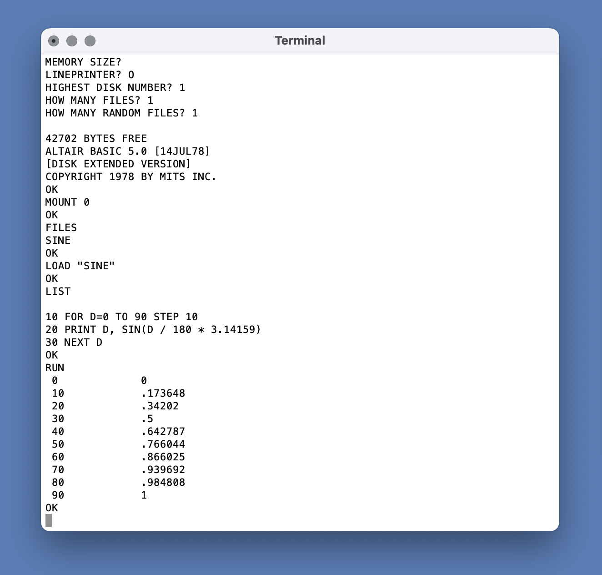

# Audiomoth Altair

A simulation of the Altair 8800 with 64KB RAM and up to 16 floppy disk drives, running Altair Extended Disk BASIC 5.0 on an AudioMoth device. The simulation creates and uses floppy disk images on an SD card and uses the AudioMoth external SRAM for memory. It will not run on the AudioMoth USB Microphone hardware.

#### Usage ####

Clone the contents of [AudioMoth-Project](https://github.com/OpenAcousticDevices/AudioMoth-Project).

Copy the contents of the ```src``` and ```inc``` folders into the AudioMoth Project file structure and compile as described there.

The resulting ```audiomoth.bin``` file, or the pre-compiled ```AudioMoth-Altair-8800-Disk-1.0.0.bin```, can be written to any AudioMoth device using the [AudioMoth Flash App](https://www.openacousticdevices.info/applications).

Switch from USB/OFF to DEFAULT or CUSTOM to run the Altair 8800 simulator. Switching from DEFAULT to CUSTOM, or vice versa, at any time will reset the simulator.

The simulator appears a USB Serial device which can be connected to through any serial application, or from the command line:

```
> screen /dev/tty.usbmodem101
```

An example screenshot is shown below:



#### Disk Commands

Use ```MOUNT n``` to mount a specific floppy disk. Use ```DSKINI n``` to format a floppy disk before mounting. If the disk number is omitted, then disk 0 is assumed.

Use ```FILES n``` to view the files on a floppy disk. Filenames are case sensitive and up to 8 characters long.

Use ```SAVE "name",n``` and ```LOAD "name",n"``` to save and load files. Use ```RUN "name",n``` to load and run a file. 

Use ```KILL "name",n``` to delete a file and ```NAME "old_name" AS "new_name",n``` to rename a file.

There are no commands to copy files betwween disks. However, programs can be loaded and resaved.

#### Libraries 

The simulator uses the lib8080 code from [here](https://github.com/GunshipPenguin/lib8080/).
